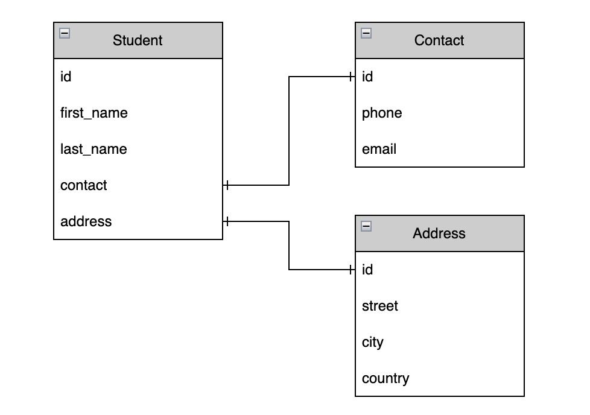

# student_relationship

This is a simple Django project that demonstrates how to create a one-to-one relationship between two models.

## Database diagram



## Database schema

1.Student

| Column Name | Data Type | Description |
| :--- | :--- | :--- |
| id | integer | Primary key |
| first\_name | string |  Student first name |
| last\_name | string | Student last name |
| contact | integer | Foreign key to contact table |
| address | integer | Foreign key to address table |

2.Contact

| Column Name | Data Type | Description |
| :--- | :--- | :--- |
| id | integer | Primary key |
| phone | string | Student phone number |
| email | string | Student email address |

3.Address

| Column Name | Data Type | Description |
| :--- | :--- | :--- |
| id | integer | Primary key |
| street | string | Student street address |
| city | string | Student city |
| country | string | Student country |

## getting started

1. Create a virtual environment

    ```bash
    python3 -m venv venv
    ```

2. Activate the virtual environment

    linux and mac

    ```bash
    source venv/bin/activate
    ```

    windows

    ```bash
    source venv/Scripts/activate
    ```

3. Install the requirements

    ```bash
    pip install -r requirements.txt
    ```

4. Start project

    ```bash
    django-admin startproject core
    ```

5. Start app

    ```bash
    python manage.py startapp api
    ```

6. Add app to settings.py

    ```python
    INSTALLED_APPS = [
        'api.apps.ApiConfig',
    ]
    ```

7. Create models

    `api/models.py`

    ```python
    class Contact(models.Model):
        phone = models.CharField(max_length=50)
        email = models.CharField(max_length=50)

        def __str__(self):
            return self.phone + ' ' + self.email

    class Address(models.Model):
        street = models.CharField(max_length=50)
        city = models.CharField(max_length=50)
        country = models.CharField(max_length=50)

        def __str__(self):
            return self.street + ' ' + self.city + ' ' + self.country

    class Student(models.Model):
        first_name = models.CharField(max_length=50)
        last_name = models.CharField(max_length=50)
        contact = models.OneToOneField(Contact, on_delete=models.CASCADE)
        address = models.OneToOneField(Address, on_delete=models.CASCADE)

        def __str__(self):
            return self.first_name + ' ' + self.last_name
    ```

8. Register models in admin.py

    ```python
    from django.contrib import admin
    from .models import Student, Contact, Address

    admin.site.register(Student)
    admin.site.register(Contact)
    admin.site.register(Address)
    ```

9. Create migrations

    ```bash
    python manage.py makemigrations api
    ```

10. Migrate

    ```bash
    python manage.py migrate
    ```

11. Create superuser

    ```bash
    python manage.py createsuperuser --username "admin" --email "example@gmail.com"
    ```

12. Run server

    ```bash
    python manage.py runserver
    ```
